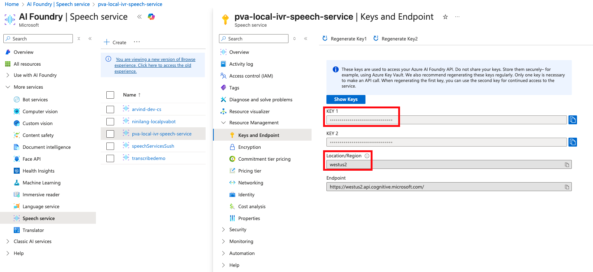
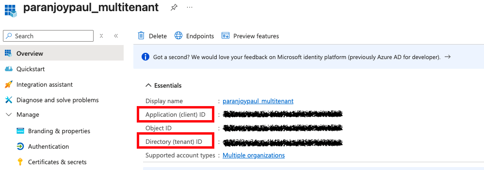
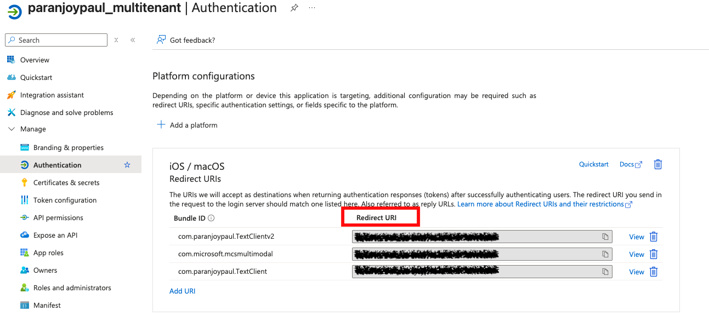

# Welcome to AgentsClientSDK.iOS

We make it easy for you to have multi modal interactions with the agents created through Microsoft
Copilot Studio (MCS) and Agents SDK.

You can now text and talk to your agent.
There are exciting new updates coming up. 

Currently, our SDK is only available for private preview and will have to be included as a local
build dependency. We will very soon be available on major package managers/ repositories - ex. SPM

Follow along to add the iOS SDK to your app for multimodal agent interactions.

## Getting started with iOS

This tutorial will help you connect with an agent created and published in Copilot Studio without authentication.
The SDK connects to agents using Directline protocol, which enables anonymous text based agent
interactions through websockets.

To ensure a smooth and successful integration of the SDK with your application, please make sure your development environment meets the following prerequisites.

#### Target device supported 

- iOS 14.0+

#### Dev Env Prerequisites

- Xcode 12.0+
- Swift 5.0+

#### Swift Language & XCFramework

This SDK is built entirely in **Swift** and distributed as an **XCFramework**

#### XCFramework Structure

XCFramework is Apple's binary distribution format that packages multiple architectures (iOS, macOS, simulator, etc.) into a single bundle for easier library distribution and consumption across different platforms. AgentsClientSDK supports only iOS devices and iOS simulators 


```
AgentsClientSDK.xcframework/
├── ios-arm64/              # Physical iOS devices
├── ios-arm64_x86_64-simulator/  # iOS Simulator
└── Info.plist             # Framework metadata
```

#### XCFramework Integration 

1. Download the `AgentsClientSDK.xcframework` from https://github.com/microsoft/AgentsClientSDK.iOS/releases/
2. Also download and extract the signed zip file `MSAL.xcframework` from https://github.com/AzureAD/microsoft-authentication-library-for-objc/releases/download/2.4.0/MSAL.zip, if you are planning to use Authentication
3. Also download and extract `MicrosoftCognitiveServicesSpeech.xcframework` from https://aka.ms/csspeech/iosbinary, if you are planning to use ACogs for speech processing
4. Drag them into your Xcode project
5. Add to "Frameworks, Libraries, and Embedded Content"
6. Set to "Embed & Sign"

### API Reference

#### Core Methods

##### `initSDK(appSettings:)` or `initSDK(authenticationDelegate: appSettings:)`
Initialize the SDK with required parameters. Use the second one if you enabled authentication.

##### `sendMessage(text:) async`
Send a text message to the bot asynchronously.

#### Authentication Methods : This is the authenticated end user scenario. Support will be added in later versions.

##### `signIn(presentingViewController:showSignIn:)`
Perform interactive sign-in.

### Available Properties

##### Published Properties (Observable)

- `messages: [ChatMessage]` - Array of chat messages

### Once you have created a new application or project in XCode, follow these steps to add the AgentsClientSDK to your project.

### Step 1: Include in build

Include the AgentsClientSDK.xcframework file as a dependency. Optionally include MSAL.xcframework and/or MicrosoftCognitiveServicesSpeech.xcframework as required. 

### Step 2: Import AgentsClientSDK classes in your ContentView
In this step, you import the AgentsClientSDK into your ContentView. This allows your application to access the SDK’s core functionality and configuration models, enabling you to initialize and interact with the SDK in your app’s code. Proper import is required for successful compilation and usage of the SDK features.

``` 
import AgentsClientSDK
```
### Step 3: Configure the SDK with appsettings.json

This step guides you to create an `appsettings.json` file in your project directory. This
configuration file provides the necessary environment, agent, and speech settings required by the
SDK to connect and function correctly. The file should look like this:

```json
{
  "user": {                       // Contains user and authentication configuration.
    "environmentId": "",          // Unique identifier for the environment in which agent is created. Available in agent Metadata
    "schemaName": "",             // Name of the schema name of agent. Also available in agent Metadata
    "environment": "",            // Specifies the environment (e.g., preprod, prod). Mapping given below
    "isAuthEnabled": Boolean,     // Enables or disables authentication.
    "auth": {                     // Authentication details.
      "clientId": "",             // Application's client ID for authentication.
      "tenantId": "",             // Directory (tenant) ID for authentication.
      "redirectUri": ""           // URI to redirect after authentication.
    }
  },
  "speech": {                     // Contains "ACogs" speech service configuration.
    "enabled": Boolean,           // Enables or disables speech features.
    "speechSubscriptionKey": "",  // API key for the speech service.
    "speechServiceRegion": ""     // Region for the speech service.
  }
}
```

Environment mapping:

```
copilotstudio.microsoft.com -> prod
copilotstudio.preview.microsoft.com -> prod
copilotstudio.preprod.microsoft.com -> preprod
```

For ACogs, you'll find the keys in the Azure portal under AI Foundry | Speech service
[Learn More](https://learn.microsoft.com/en-us/azure/ai-services/speech-service/)



For Authentication, you'll find the releveant keys in your Azure portal's App Registration
[Learn More](https://learn.microsoft.com/en-us/entra/identity-platform/quickstart-register-app)






### Step 4: Initialize the SDK Connection in Your App

This step demonstrates how to load your configuration from appsettings.json and initialize the AgentsClientSDK in your App. Proper initialization ensures the SDK is ready to connect to your agent and handle user interactions as soon as your app starts. This setup is essential for enabling communication between your app and the agent using the provided settings.

```
@State private var appSettings: AppSettings?

private func loadAppSettings() -> AppSettings? {
    guard let url = Bundle.main.url(forResource: "appsettings", withExtension: "json") else {
        print("Could not find appsettings.json file in bundle")
        return nil
    }
    
    do {
        let data = try Data(contentsOf: url)
        let appSettings = try JSONDecoder().decode(AppSettings.self, from: data)
        return appSettings
    } catch {
        print("Error loading or parsing appsettings.json: \(error)")
        return nil
    }
}

 self.appSettings = loadAppSettings()
```

The below sample demonstrates how to initialize the AgentsClientSDK, typically in your App.

During initialization, the SDK requires one parameter: appSettings: , and optionally authenticationDelegate: if you require authentication. The configuration object created in the previous step, essential for the SDK’s core functionality.

``` 
    @State private var agentsClientSdk: ClientSDK?
    // Always initialize SDK first
    self.agentsClientSdk = try await AgentsClientSdk.shared.initSDK(appSettings: appSettings)
```
or 

``` 
    @State private var agentsClientSdk: ClientSDK?
    // Always initialize SDK first
    self.agentsClientSdk = try await AgentsClientSdk.shared.initSDK(authenticationDelegate:self, appSettings: appSettings)
```


### Step 5: Implement IAuthenticationUI Protocol if you have enabled authentication
#### Your view or controller should conform to IAuthenticationUI to handle authentication UI events
```swift
class MyViewController: UIViewController, IAuthenticationUI {
    func showSignInContent() { /* Show sign-in UI */ }
    func hideSignInContent() { /* Hide sign-in UI */ }
    func showSignInLoading() { /* Show loading indicator */ }
    func hideSignInLoading() { /* Hide loading indicator */ }
    func getPresentingViewController() async -> UIViewController? { return self }
}
```

### Step 6: Chat window for Rendering message
#### Published Messages Array within Sdk
```swift
@Published public var messages: [ChatMessage] = []
```

This is the primary storage for chat messages that automatically updates SwiftUI views when modified. It's declared as a `@Published` property, making it observable by SwiftUI components.

#### ChatMessage

```swift
public struct ChatMessage: Identifiable {
    public let id: UUID
    public let text: String?
    public let sender: String
    public let imageUrl: String?
    public let customView: UIView?
    public let suggestedActions: [String]?
}
```
#### SwiftUI Integration
```swift
struct ChatView: View {
    @ObservedObject var agentsClientSdk: ClientSDK
    var body: some View {
        // Automatically updates when messages change
        ForEach(agentsClientSdk.messages) { message in
            MessageRow(message: message)
        }
    }
}
```

### Step 7. Send Messages

This step demonstrates how to send a message from your app to the agent using the SDK. The sendMessage function is called on the sdk instance, passing the user's input text. This triggers the SDK to forward the message to the agent and handle the response, which will be reflected in the chat UI with the help of messages.

This is a simple, direct way to send user input to the agent. You can call this method from any part of your app where you want to initiate a conversation or respond to user actions.

```swift
// Send a text message to the bot
await agentsClientSdk.sendMessage(text: "Hello, how can you help me?")
```

## Troubleshooting

### Common Issues

1. **Bot communication issues**: Verify network connectivity and app settings.


Thats the essence of it.
The TextClientApp in samples folder of this repository provides a complete implementation. Do
check it out.

## Contributing

This project welcomes contributions and suggestions. Most contributions require you to agree to a
Contributor License Agreement (CLA) declaring that you have the right to, and actually do, grant us
the rights to use your contribution. For details, visit https://cla.opensource.microsoft.com.

When you submit a pull request, a CLA bot will automatically determine whether you need to provide
a CLA and decorate the PR appropriately (e.g., status check, comment). Simply follow the
instructions
provided by the bot. You will only need to do this once across all repos using our CLA.

This project has adopted
the [Microsoft Open Source Code of Conduct](https://opensource.microsoft.com/codeofconduct/).
For more information see
the [Code of Conduct FAQ](https://opensource.microsoft.com/codeofconduct/faq/) or
contact [opencode@microsoft.com](mailto:opencode@microsoft.com) with any additional questions or
comments.

## Trademarks

This project may contain trademarks or logos for projects, products, or services. Authorized use of
Microsoft
trademarks or logos is subject to and must follow
[Microsoft's Trademark & Brand Guidelines](https://www.microsoft.com/en-us/legal/intellectualproperty/trademarks/usage/general).
Use of Microsoft trademarks or logos in modified versions of this project must not cause confusion
or imply Microsoft sponsorship.
Any use of third-party trademarks or logos are subject to those third-party's policies.
